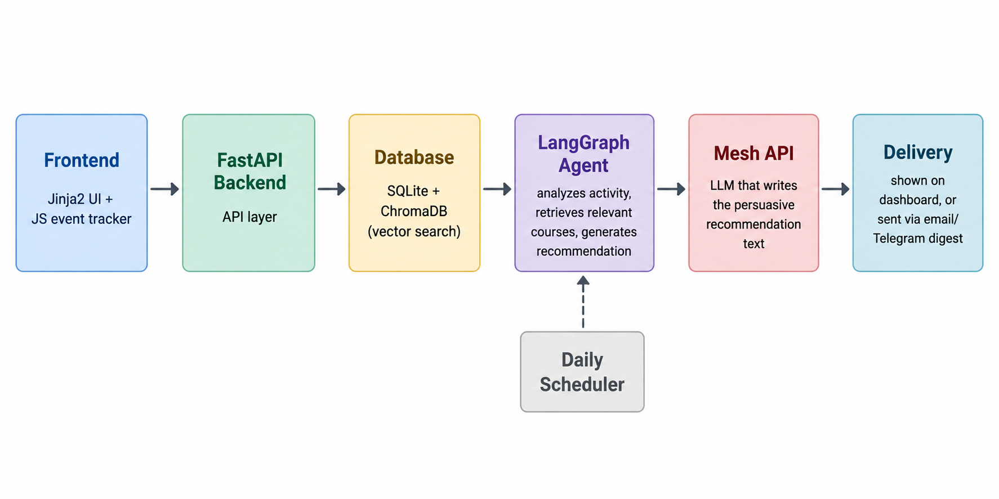

# SmartReco — Behavioral AI Recommendation Agent

SmartReco is an agentic e-learning recommendation platform powered by FastAPI, ChromaDB, LangGraph, and the Mesh API. It tracks learner behavior in real time, scores interest signals, retrieves catalog-grounded candidates via RAG, and runs a LangGraph agent to generate personalized, persuasive recommendations — refreshed automatically and delivered proactively.



---

## 🌟 How It Works

1. **Behavioral Ingest** — client-side tracker (`static/js/tracker.js`) captures views, dwell time, searches, clicks, enrollments, dismissals, and scroll depth; batches and flushes non-blocking via `POST /api/track`.
2. **Scoring & Triggering** — `services/scoring_engine.py` scores interest per category (recency decay, dwell multipliers, frequency boost). `services/trigger.py` only fires the agent once genuine new signal (5+ events) plus a cooldown window has passed — no LLM call on every click.
3. **LangGraph Agent** (`services/agent_graph.py`) — `analyze_activity → decide_retrieval → retrieve → evaluate_retrieval_quality → refine → generate`. Retrieves category/level-aware candidates from ChromaDB, re-ranks, and generates a grounded narrative.
4. **LLM Narrative** — every LLM/embedding call goes through the **Mesh API** (OpenAI-compatible gateway); output is validated against real catalog titles before being shown (`validate_narrative_grounding`).
5. **Proactive Delivery** — APScheduler dispatches daily digests via SMTP Email / Telegram at a scheduled hour (not a manual button).

### Dual-Write (SQL + Vector DB)
Every product create/update/delete writes to **SQLite** (source of truth) and **ChromaDB** (embeddings via Mesh) together, logged in `ChromaSyncLog`. If the Chroma half fails (e.g. Mesh outage), the SQL row is still committed — nothing is lost, it's just temporarily missing from semantic search until an **hourly self-healing job** (`reconcile_vector_store()`, also triggerable at `POST /api/admin/reconcile-vectors`) retries and repairs it. Covered end-to-end by `tests/smoke_test.py` Section [9].

---

## ✅ Features Implemented

**Core Platform** — email/password auth (bcrypt), session-based login, dual-mode users (student/instructor), full catalog CRUD, dual-write sync, rate limiting on `/login` (10 req/60s) and `/signup` (5 req/60s) via `services/rate_limit.py`.

**Behavioral Tracking** — batched + debounced client tracker, `sendBeacon` flush on tab close, bot-noise filter (<0.3s duplicate drop), scroll-depth milestones (captured client-side, persisted server-side, and factored into category scoring via `services/scoring_weights.EVENT_BASE_WEIGHTS["scroll_depth"]`), opt-in/out tracking preference.

**Agentic Recommendation Engine** — multi-factor scoring engine, hybrid RAG retrieval (category + level aware), trigger-gated generation (5-event threshold + cooldown), 10-minute recommendation response cache (`services/recommendation_cache.py` → `CACHE_TTL_SECONDS`).

**Bonus (Level 6)** — LangGraph structured agent ✅ · scheduled daily digest via real cron (APScheduler, email + Telegram) ✅ · scheduled vector self-healing ✅ · LangSmith tracing ✅ · retrieval re-ranking ✅ · LLM grounding/hallucination guard ✅.

---

## 📁 Project Structure

```
smartreco/
├── database/       # SQLAlchemy models, engine/session, ChromaDB client
├── routers/        # auth, products, events, recommendations, monitoring
├── services/       # scoring, trigger, retrieval, agent_graph, llm_client,
│                    product_service (dual-write), scheduler, rate_limit, ...
├── static/js/      # tracker.js (event batching), debounce.js
├── templates/      # Jinja2 pages (dashboard, catalog, admin, ai-insights, ...)
├── tests/          # smoke_test.py
├── scripts/        # eval_recommendations.py
├── .github/workflows/  # smartreco-checks.yml (hackathon auto-grading CI)
├── main.py, create_admin.py, seed_data.py, resync_chroma.py
└── requirements.txt, .env.example
```

---

## 🛠️ Tech Stack

| Layer | Technology |
| :--- | :--- |
| **Backend Framework** | Python 3.10+ / FastAPI / Uvicorn |
| **Relational Database** | SQLite / SQLAlchemy ORM |
| **Vector Database** | ChromaDB — embeddings generated exclusively via the **Mesh API** (`text-embedding-3-small`) |
| **LLM Gateway** | Mesh API (mandatory, OpenAI-compatible) |
| **Agent Framework** | LangGraph (`StateGraph`) |
| **Background Scheduler**| APScheduler (`BackgroundScheduler`) |
| **Observability** | LangSmith (`langsmith` `@traceable`) + FastAPI `/metrics` & `/health` |
| **Frontend** | HTML5 / Jinja2 Templates / Vanilla JavaScript / Custom CSS |

---

## ⚙️ Setup & Running Locally

```bash
git clone https://github.com/Abdullah-qazi-1/smartreco-agentic-recommender.git
cd smartreco-agentic-recommender
python -m venv venv && source venv/bin/activate   # Windows: venv\Scripts\activate
pip install -r requirements.txt

cp .env.example .env   # then fill in SESSION_SECRET + MESH_API_KEY (required)

uvicorn main:app --reload --port 8000   # → http://localhost:8000
```

> **Note:** `chroma_db/` and `smartreco.db` are shipped **pre-built** (seeded catalog + embeddings) to avoid re-running Mesh embedding calls on every clone. If both are already present, skip seeding entirely. Only run `python seed_data.py && python create_admin.py` if starting from a genuinely empty database. If SQLite/Chroma ever drift, resync with `python resync_chroma.py`.

**Required env vars:** `SESSION_SECRET`, `MESH_API_KEY` (+ optional `MESH_MODEL`, `MESH_EMBED_MODEL`, `MESH_BASE_URL`). **Optional:** LangSmith (`LANGCHAIN_*`), digest delivery (`SMTP_*`, `TELEGRAM_*`), and the security knobs below. Full list with defaults is in `.env.example`.

### CI / Automated Checks

`.github/workflows/smartreco-checks.yml` is present and configured for the SmartReco Build Challenge auto-grading pipeline. It runs on every push to `main` and requires two repository secrets set under **Settings → Secrets and variables → Actions**:

- `MESH_API_KEY` — your Mesh API key
- `SUBMISSION_TOKEN` — your submission token from the challenge dashboard

Results appear under the repo's **Actions** tab.

---

## 🧠 How the Recommendation Engine Works

### 1. Mathematical Scoring Engine (`services/scoring_engine.py`)
SmartReco calculates per-category interest scores using a composite scoring formula:

- **Base Weights**: `enroll` (5.0), `search` (3.0), `view` (1.0), `time_spent` (1.0), `click` (0.5), `dismiss` (-1.0), `scroll_depth` (see `EVENT_BASE_WEIGHTS`).
- **Recency Decay**: Exponential decay with a 7-day half-life: $w_{recency} = 0.5^{\frac{\text{days\_ago}}{7}}$.
- **Dwell-Time Multiplier**: View events are scaled by dwell time:
  - `< 5s`: `0.2×` (quick bounce)
  - `5s - 30s`: `1.0×` (standard view)
  - `30s - 120s`: `1.5×` (engaged reading)
  - `> 120s`: `2.0×` (deep study)
- **Frequency Boost**: Dampened log boost for repeated interest: $boost = 1 + \log_2(\text{count} + 1)$.
- **Explicit Interest Boost**: `1.5×` multiplier for categories declared during onboarding.
- **Conflicting Interest 3× Dominance Rule**: If the top category score is $> 3\times$ the second category score, retrieval isolates the dominant category. Otherwise, the engine blends candidates from the top 2 categories.

### 2. Trigger & Caching (`services/trigger.py`)
`should_regenerate(db, user)` only fires the agent once 5+ new signal events have accumulated since the last recommendation, plus a cooldown window — no LLM call per click. The `GET /api/recommendations` response is cached in-memory per user (10-minute TTL, `services/recommendation_cache.py` → `CACHE_TTL_SECONDS`), keyed to a fingerprint of the user's latest `Recommendation` row — so it's evicted immediately on any real change, and the TTL only bounds how long an unchanged payload is reused for repeat fetches.

### 3. LangGraph Nodes (`services/agent_graph.py`)
```
[START] → analyze_activity → decide_retrieval → retrieve → evaluate_retrieval_quality → refine → generate → [END]
```
`retrieve` does category-constrained RAG search in ChromaDB; `evaluate_retrieval_quality` routes to `refine` (widened filters, re-search once) if the top match is weak; `generate` calls Mesh, validates title grounding, and saves the `Recommendation`.

---

## 🧪 Testing

```bash
python tests/smoke_test.py              # full backend suite, no live Mesh key needed — 33 assertions across 11 sections,
                                         # including concurrent dual-write race conditions (Section 10) and
                                         # a Mesh key invalidated mid-request (Section 11)
python scripts/eval_recommendations.py  # recommendation quality: single-category, mixed-signal, cold-start profiles
```

To test the daily digest without waiting for the scheduled hour: `POST /api/admin/run-digest` (requires a real admin session — see Security section below). For LangSmith tracing, set `LANGCHAIN_TRACING_V2=true` + `LANGCHAIN_API_KEY` in `.env`, trigger a refresh, then check the `smartreco` project at [smith.langchain.com](https://smith.langchain.com/).

---

## 🔌 API Endpoints Summary

| Method | Endpoint Path | Access Level | Description |
| :--- | :--- | :--- | :--- |
| `POST` | `/api/track` | Authenticated | Ingest bulk client behavioral events |
| `GET` | `/api/search` | Authenticated | Real-time catalog search with semantic re-ranking |
| `GET` | `/api/recommendations` | Authenticated | Retrieve current user's active recommendation |
| `POST` | `/api/recommendations/refresh` | Authenticated | Force-trigger recommendation pipeline |
| `POST` | `/api/admin/run-digest` | **Admin only** | Manually execute proactive daily digest job |
| `GET` | `/api/admin/digest-readiness` | **Admin only** | Pre-flight check: channels configured, active-users-today count — sends nothing |
| `GET` / `POST` | `/api/admin/analytics`, `/api/admin/reconcile-vectors` | **Admin only** | Analytics summary / manual vector self-heal |
| `GET` | `/metrics` | **Admin only** | Operational metrics (LLM stats, trigger fire rates) |
| `GET` | `/health` | Public | System health check (SQLite, ChromaDB, LLM provider) |

---

## 🔒 Security — Recent Hardening

A security review found and fixed the following. All 25 `smoke_test.py` assertions plus a dedicated live login-flow regression test (signup → login → wrong password → logout → re-login → rate-limit) pass after these changes — **no existing functionality was affected.**

| Issue | Fix |
| :--- | :--- |
| **Privilege escalation**: `/metrics`, `/api/analytics`, `/api/admin/run-digest`, `/api/admin/reconcile-vectors` accepted `role=="admin"` **OR** `active_mode=="instructor"` — and any user can self-switch to instructor mode via `POST /api/switch-mode` (by design, for course-management). This let any regular user reach admin-only operations. | `routers/monitoring.py` now requires `role=="admin"` only on all four routes. Live-verified: unauthenticated → 401, authenticated non-admin (student and instructor mode alike) → 403 on all four. |
| **Course-ownership spoofing**: `routers/products.py` → `_can_manage_course()` granted edit/delete rights on ANY course if `product.instructor_name` was a *substring* of the logged-in user's self-reported `user.name` — e.g. signing up as "Andrew Ng Fan Page" passed the check for courses owned by "Andrew Ng". | Tightened to exact ownership check: `product.instructor_id == user.id` only, the real foreign key. Seed/demo courses (`instructor_id IS NULL`) can only be managed by an admin now, regardless of display name. Re-verified live: a spoofed account now gets `403 forbidden`. |
| **No rate-limiting on `/login` or `/signup`** — unlimited password-guessing was possible. | Added to `services/rate_limit.py`: `/login` (10 req/60s), `/signup` (5 req/60s). Normal users retrying a typo are never affected. |
| **Rate limiter trusted `X-Forwarded-For` unconditionally** — a client-supplied header, trivially spoofable to bypass IP-based limits. | Now only trusted if `TRUST_PROXY_HEADERS=true` is explicitly set (for real deployments behind a reverse proxy); defaults to the real socket peer address. |
| **Session cookie never expired, no `https_only` control.** | Added `SESSION_MAX_AGE_SECONDS` (default 7 days) and `SESSION_COOKIE_SECURE` env var (set `true` once deployed behind HTTPS). |

New optional env vars (defaults keep local dev unchanged): `SESSION_COOKIE_SECURE`, `SESSION_MAX_AGE_SECONDS`, `TRUST_PROXY_HEADERS` — see `.env.example`.

### Concurrency — Two Admins Editing the Same Product/Course

There is no optimistic-locking (`version`) column on `Product` — this is a conscious tradeoff for a low-contention admin/instructor catalog (course edits are infrequent and rarely truly simultaneous), not an oversight. What actually happens if two admins DO submit an edit to the exact same course at the same moment, verified live via a real dedicated test (`tests/smoke_test.py` Section 10, two OS threads with two independent `SessionLocal()` sessions hitting `update_product()` on the same row concurrently):

- **SQL side**: SQLite (WAL mode, `check_same_thread=False`) serializes the two `COMMIT`s at the engine level — one fully succeeds, then the other fully succeeds, in whichever order the two requests happen to reach the database. The result is **clean last-write-wins**: the final row is *entirely* one admin's submitted values, never a corrupted mix/interleave of both. Neither write is silently lost — both commits succeed, the second simply supersedes the first's values for any overlapping fields.
- **Vector (Chroma) side**: `database/chroma_client.py` previously had no synchronization around the shared `_collection` object — concurrent writes could intermittently fail even when both embeddings succeeded (a real race, caught by writing this exact test). Fixed with a `threading.Lock()` around the actual `_collection.upsert()`/`.delete()` calls (embedding generation itself — the slow network part — stays outside the lock, so this doesn't serialize the expensive part, only the fast local write).
- **No corruption, no crash, no exception** in either case — verified by running the concurrency test 15 consecutive times with zero flakiness after the fix.
- **Known limitation**: because there's no optimistic lock, the "losing" admin gets no warning that their edit was overwritten seconds later by the other admin — they'd only notice on a page refresh. Adding a `version` column + a `409 Conflict` response on a stale write is the natural next step if this app moved from a low-contention admin panel to a higher-contention multi-editor workflow.

### Input Validation Limits

Explicit, enforced caps — not just "reasonable defaults left implicit":

| Limit | Value | Enforced in | Behavior when exceeded |
|---|---|---|---|
| Max events per batch | 50 | `routers/events.py` → `MAX_EVENTS_PER_BATCH` | Excess events in the array are silently truncated, not rejected (a client sending 200 events still gets its first 50 accepted) |
| Max `/api/events` request body size | 256 KB | `routers/events.py` → `MAX_REQUEST_BODY_BYTES` (checked via `Content-Length` **before** the body is parsed) | `413 Payload Too Large` |
| Max per-event metadata size (after JSON serialization) | 2,000 chars | `routers/events.py` → `MAX_METADATA_JSON_CHARS` | Metadata is truncated, not the whole event dropped — same non-fatal-degradation pattern used for Mesh/SMTP failures elsewhere in this app |
| `product_id` type on ingest | must be a real `int` or absent | `routers/events.py` | Event is dropped (not silently coerced/stored) if the client sends a non-integer `product_id` — avoids polluting the FK column with garbage that downstream joins (e.g. `digest-readiness`'s active-user math) assume is always a clean int or `NULL` |
| Max search query length | 200 chars | `routers/products.py` → `MAX_SEARCH_QUERY_LENGTH` | Query is truncated before being sent to Mesh for embedding or to the SQL keyword-fallback path — caps wasted embedding cost/DB scan time on garbage-length input |
| Login rate limit | 10 req / 60s per IP | `services/rate_limit.py` | `429 Too Many Requests` |
| Signup rate limit | 5 req / 60s per IP | `services/rate_limit.py` | `429 Too Many Requests` |

All six live-verified with real HTTP requests against a running server (oversized payload → `413`, malformed `product_id` → event dropped cleanly, 500-char query → truncated with `200 OK`, no crash in any case).

### Startup Environment Validation

`main.py` runs `_validate_optional_env_at_startup()` at boot (logged via `smartreco.startup`):

- `SESSION_SECRET` missing → **fatal**, refuses to start (unchanged from before — a session-signing key is not optional).
- `MESH_API_KEY` missing → **non-fatal** `WARNING` log only. This is intentional, not a gap: the whole point of the "Resilience — What Happens Without Mesh" design below is that the app must still boot and serve non-AI paths without a key configured.
- `MESH_API_KEY` present but **doesn't start with `rsk_`** (the documented Mesh key format) → `WARNING` log flagging it as likely a copy-paste mistake (wrong var, a raw OpenAI key, unstripped whitespace) — this is deliberately a warning, not a boot failure, since Mesh could plausibly change key formats and a startup check shouldn't hard-block on a shape assumption; but it turns a confusing "every AI request 401s and I don't know why" debugging session into an obvious line in the startup log.
- `LANGCHAIN_TRACING_V2=true` set without a `LANGCHAIN_API_KEY` → `WARNING` log — tracing would otherwise silently no-op with no indication why nothing shows up in LangSmith.

Live-verified: booting with `MESH_API_KEY=bad-format-key-not-rsk` prints the expected warning and the app still serves requests normally.

---

## 🛡️ Resilience — What Happens Without Mesh

Only `SESSION_SECRET` is required at app startup — `MESH_API_KEY` is checked lazily at point of use, not at boot. Verify it yourself: `MESH_API_KEY="" python tests/smoke_test.py`.

Every Mesh-dependent path degrades gracefully instead of crashing or returning a 500:

| Dependency | If unavailable | Where |
| --- | --- | --- |
| Mesh chat (narrative generation) | Falls back to a short, honest generic sentence ("Based on your recent activity, here are a few courses...") instead of crashing. Every fallback is logged at `ERROR` level with the underlying exception, so it's visible in ops, not silent. | `services/llm_client.py` → `generate_narrative()` |
| Mesh embeddings (search / retrieval) | Falls back to `services/keyword_fallback.py` — plain SQL `LIKE` matching on title/skills/category/description, ranked by title-match strength, then this user's prior time-spent on that product, then rating/popularity. No AI call involved in the fallback path. | `database/chroma_client.py` → `embed_text()`, caught by callers in `services/product_service.py` |
| Mesh dual-write on product create/update/delete | The SQL row is still saved/updated even if the Chroma half fails; the miss is recorded in `ChromaSyncLog(status="failed")` for visibility. An hourly `run_vector_reconcile_job()` automatically retries failed syncs — see `services/product_service.reconcile_vector_store()`. | `services/scheduler.py`, `services/product_service.py` |
| SMTP (daily digest email) | If `SMTP_HOST`/`SMTP_USER`/`SMTP_PASS` aren't fully configured, `send_email_digest()` logs and skips that user's email — the digest job continues for other users/channels instead of failing the whole batch. | `services/scheduler.py` → `send_email_digest()` |
| Telegram (daily digest) | If `TELEGRAM_BOT_TOKEN` isn't set, `send_telegram_digest()` skips silently (logged at `DEBUG`) — same non-fatal pattern as email. | `services/scheduler.py` → `send_telegram_digest()` |
| LangGraph (agent orchestration) | `build_recommendation_graph()` catches any import/compile failure and returns `None`; `run_recommendation_pipeline()` then runs the exact same six node functions (`analyze_activity → decide_retrieval → retrieve → evaluate_retrieval_quality → refine → generate`) as a plain sequential call instead of a compiled `StateGraph` — identical logic, no LangGraph dependency required at runtime. | `services/agent_graph.py` → `run_recommendation_pipeline()` |

Only `MESH_API_KEY` is required for the AI features to produce real (non-fallback) output — the app itself does not crash at startup or at request time without it.

## 🔎 Observability

`langsmith`'s `@traceable` decorator is applied to all six LangGraph nodes — `analyze_activity`, `decide_retrieval`, `retrieve`, `evaluate_retrieval_quality`, `refine`, and `generate` — plus the underlying `generate_narrative()` LLM call in `services/llm_client.py`. Enabling `LANGCHAIN_TRACING_V2=true` + `LANGCHAIN_API_KEY` (and optionally `LANGCHAIN_PROJECT`) gives a full node-by-node trace tree in LangSmith for every recommendation run — each node's input/output and timing, not just the final LLM call. If `langsmith` isn't installed, `@traceable` no-ops to a plain pass-through (same pattern as the Mesh degradation paths above), so tracing is purely additive and never a hard dependency.

## 🎥 Live Demo: Triggering the Daily Digest

The daily digest normally fires on its own via APScheduler cron at `DIGEST_SCHEDULE_HOUR:DIGEST_SCHEDULE_MINUTE` UTC (see `services/scheduler.py`). For a demo/proof video, you don't have to wait for that scheduled hour — you can fire the exact same job on demand.

1. **Configure delivery channels in `.env`** (at least one of these; both are optional independently):
   - Email (SMTP): `SMTP_HOST`, `SMTP_PORT`, `SMTP_USER`, `SMTP_PASS`, `DIGEST_FROM_EMAIL`
   - Telegram: `TELEGRAM_BOT_TOKEN`, `TELEGRAM_CHAT_ID`
2. **Log in as an admin** and open `/admin` — scroll to the **"Recommendation Analytics & System Health"** panel, then the **"Proactive Daily Digest"** card.
3. **Click "Check Readiness"** first. This calls `GET /api/admin/digest-readiness` and reports, without sending anything:
   - whether SMTP / Telegram are configured (booleans only — secrets are never returned)
   - how many users have activity today (i.e. would be picked up by the job)
   - how many of those already have a saved recommendation vs. would need one generated on the fly
4. **Click "Trigger Digest Now"** to actually send. This calls `POST /api/admin/run-digest`, which runs the real `run_daily_digest_job()` — the identical function the cron job calls — and returns a JSON summary (`processed_users`, `emails_sent`, `telegrams_sent`, `errors`), shown directly in the panel for the recording.
5. **Keep the terminal visible** while recording — `send_email_digest` / `send_telegram_digest` log `DIGEST SENT [email] recipient=...` / `DIGEST SENT [telegram] recipient=...` (or `DIGEST FAILED [...] recipient=...` on failure) at INFO level, so each delivery attempt is visible in the uvicorn console as it happens.

Both endpoints are admin-only (same `user.role != "admin"` check used by the other `/api/admin/*` routes) — they are not reachable from instructor or student accounts.

You can also call these directly, e.g. for scripting the demo:

```bash
curl -s http://localhost:8000/api/admin/digest-readiness -b "session=<your_admin_session_cookie>"
curl -s -X POST http://localhost:8000/api/admin/run-digest -b "session=<your_admin_session_cookie>"
```

## Responsible Use

The agent only uses on-site behavioral signals a user generated themselves (views, searches, clicks, dwell time) — it does not infer or use protected characteristics. `services/llm_client.py`'s system prompt explicitly forbids inventing course titles, prices, instructors, or ratings not present in the retrieved catalog data, and every generated narrative is checked by `validate_narrative_grounding()` before being shown; if a generated narrative fails that check twice, the honest generic fallback is served instead. A production deployment should still add explicit tracking consent, a data export/deletion flow, and retention limits beyond what this submission implements.

---

## 📄 License & Credits

Developed for the SmartReco Hackathon Challenge. Built with FastAPI, LangGraph, ChromaDB, and Mesh API.